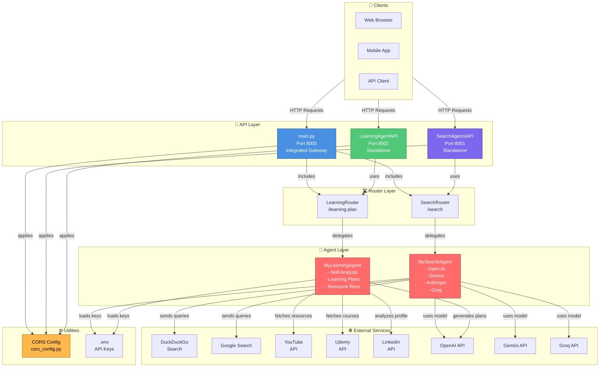

# Agentic-AI

A modular, agentic AI platform for search, document processing, and generative tasks using multiple LLM providers and search tools.  
Supports both Streamlit and FastAPI interfaces.

---

## Features

- **Multi-agent support:** Gemini, OpenAI, Anthropic, Groq, and more.
- **Pluggable search tools:** Google, DuckDuckGo, Baidu, Exa, etc.
- **Document processing:** PDF, DOCX, Excel, YouTube transcripts.
- **Streamlit UI** for interactive exploration.
- **FastAPI backend** for programmatic access.
- **Environment-based key management** for secure API usage.

---

## Project Structure

```
Agentic-AI/
│
├── api/                           # FastAPI REST API Services
│   ├── main.py                    # Integrated Gateway (Port 8000) - combines all APIs
│   ├── SearchAgentsAPI.py         # Standalone Search Service (Port 8001)
│   ├── LearningAgentAPI.py        # Standalone Learning Service (Port 8002)
│   ├── run_readme.md              # API running instructions
│   └── __pycache__/               # Python cache files
│
├── agents/                        # Agent Implementations
│   ├── MySearchAgent.py           # Multi-model search agent wrapper
│   ├── MyLearningAgent.py         # Personalized learning plan generator
│   ├── TasksAgent.py              # Task classification agent
│   ├── AgentMetrics.py            # Agent performance metrics
│   ├── DeepSeekAgent.py           # DeepSeek LLM integration
│   ├── GeminiAgent.py             # Google Gemini integration
│   ├── GroqAgent.py               # Groq LLM integration
│   ├── OpenAIAgent.py             # OpenAI integration
│   ├── tasks.txt                  # Sample task definitions
│   └── __pycache__/               # Python cache files
│
├── agno/                          # Core Agent & Tool Modules
│   ├── AudioAgent.py              # Audio processing agent
│   ├── BlogGeneratorAgent.py      # Blog generation agent
│   ├── ExcelDataAgent.py          # Excel file processing
│   ├── FinanceAgent.py            # Financial data analysis
│   ├── FindWeather.py             # Weather information retrieval
│   ├── ImageAgent.py              # Image processing agent
│   ├── MovieRecommendationAgent.py# Movie recommendation engine
│   ├── NewsAgent.py               # News aggregation agent
│   ├── ReasoningAgent.py          # Multi-step reasoning agent
│   ├── SQLiteDBAgent.py           # Database query agent
│   ├── VideoAgent.py              # Video processing agent
│   ├── WebAndFinanceAgent.py      # Web scraping & finance combo
│   ├── WhatsAppAgent.py           # WhatsApp integration
│   ├── YouTubeSummaryAgent.py     # YouTube video summarization
│   └── keys.py                    # API key management for agno modules
│
├── streamlit/                     # Streamlit Interactive UIs
│   ├── SearchAgentsApp.py         # Search interface
│   ├── LearningGuideApp.py        # Learning plan generator UI
│   ├── TasksClassifierApp.py      # Task classification interface
│   ├── TravelPlanningApp.py       # Travel planning assistant
│   ├── ResumeFormatter.py         # Resume formatting tool
│   └── KnowYourself.py            # Self-assessment application
│
├── autogen/                       # Microsoft AutoGen Framework
│   ├── TravelPlanningAgent.py     # AutoGen travel planning agent
│   ├── keys.py                    # API key management for autogen
│   └── __pycache__/               # Python cache files
│
├── langchain/                     # LangChain Framework Implementations
│   ├── ExcelProcessAgent.py       # LangChain Excel processing
│   └── SQLite-EmployeesData.py    # LangChain SQLite database agent
│
├── util/                          # Utility & Configuration Modules
│   ├── cors_config.py             # Centralized CORS configuration utility
│   ├── LoadMyKeys.py              # API key loader utility
│   ├── __init__.py                # Package initialization
│   └── __pycache__/               # Python cache files
│
├── misc/                          # Miscellaneous Utilities
│   ├── generate_html.py           # HTML generation helper
│   ├── MailAgent.py               # Email sending agent
│   ├── tabs_and_cards.html        # UI component template
│   ├── tabs_and_cards.json        # Component configuration
│   ├── html_part1.txt             # HTML template parts
│   └── html_part2.txt             # HTML template parts
│
├── storage/                       # Data Storage Directory
│   └── (for temporary/persistent data)
│
├── requirements.txt               # Python dependencies
├── README.md                      # Project documentation (you are here)
└── .env                          # Environment variables (create this file)
    # Required: API keys for various services
    # OPENAI_API_KEY=xxx
    # GEMINI_API_KEY=xxx
    # ANTROPHIC_API_KEY=xxx
    # GROQ_API_KEY=xxx
```

### **Directory Descriptions**

| Directory | Purpose | Key Files |
|-----------|---------|-----------|
| **api/** | FastAPI REST services with 3 deployment modes | main.py, SearchAgentsAPI.py, LearningAgentAPI.py |
| **agents/** | Wrapper agents for different LLM providers | MySearchAgent.py, MyLearningAgent.py |
| **agno/** | Core specialized agent implementations | AudioAgent.py, ExcelDataAgent.py, SQLiteDBAgent.py |
| **streamlit/** | Interactive web UIs using Streamlit | SearchAgentsApp.py, LearningGuideApp.py |
| **autogen/** | Microsoft AutoGen multi-agent framework | TravelPlanningAgent.py |
| **langchain/** | LangChain framework implementations | ExcelProcessAgent.py, SQLite-EmployeesData.py |
| **util/** | Shared utilities and configuration | cors_config.py, LoadMyKeys.py |
| **misc/** | Helper scripts and utilities | generate_html.py, MailAgent.py |
| **storage/** | Data persistence directory | (user-created files) |

---

## Architecture

The Agentic-AI platform uses a modular, layered architecture with multiple deployment options:



### **Architecture Overview**

#### **🔌 API Layer (3 Deployment Modes)**
- **main.py (Port 8000)** - Integrated gateway that combines both SearchAgentsAPI and LearningAgentAPI into a single FastAPI application. Ideal for production deployments where you want unified access to all services.
- **SearchAgentsAPI (Port 8001)** - Standalone microservice for AI-powered search operations. Can be deployed independently or integrated into main.py. Supports multiple AI agents (OpenAI, Gemini, Anthropic, Groq) and search tools.
- **LearningAgentAPI (Port 8002)** - Standalone microservice for personalized learning plan generation. Analyzes user skills and aspirations to create customized learning roadmaps with resource recommendations.

#### **🛣️ Router Layer**
- **SearchRouter** - Handles `/search` endpoint, validates requests, and delegates to SearchAgent for computation
- **LearningRouter** - Handles `/learning-plan` endpoint, manages learning plan generation requests
- Routers can be composed into different FastAPI applications for flexible deployment

#### **🤖 Agent Layer**
- **MySearchAgent** - Executes search queries using configurable AI models and search tools. Supports fallback mechanisms and response extraction from various agent types.
- **MyLearningAgent** - Analyzes user skills, identifies learning gaps, and generates personalized roadmaps with curated YouTube, Udemy, and other educational resources.

#### **🌐 External Integrations**
- **AI Models**: OpenAI (GPT series), Google Gemini, Anthropic Claude, Groq
- **Search Engines**: DuckDuckGo, Google Search
- **Learning Platforms**: YouTube, Udemy, LinkedIn
- **API Key Management**: Centralized via `.env` configuration

#### **⚙️ Utilities**
- **CORS Configuration** (`util/cors_config.py`) - Centralized CORS middleware setup shared across all APIs. Simplifies security configuration for production deployments.
- **Environment Management** (`.env`) - Securely manages API keys and credentials

### **Key Architecture Features**

✅ **Modular Design** - APIs can run standalone or integrated  
✅ **Microservices Ready** - Each API has its own port for independent scaling  
✅ **FastAPI Router Pattern** - Flexible composition of endpoints  
✅ **Shared Utilities** - DRY principle with centralized configuration  
✅ **Multi-Model Support** - Agents support multiple AI providers  
✅ **Dual-Mode Operation** - Both integrated and standalone deployment options  
✅ **Security** - Centralized CORS configuration with production-ready structure

---

## Setup

1. **Clone the repository**
   ```sh
   git clone <your-repo-url>
   cd Agentic-AI
   ```

2. **Install dependencies**
   ```sh
   pip install -r requirements.txt
   ```

3. **Set up your API keys**

   - Create a `.env` file in the project root or use `util/LoadMyKeys.py` to load your keys.
   - Example `.env`:
     ```
     OPENAI_API_KEY=your_openai_key
     ANTHROPIC_API_KEY=your_anthropic_key
     GOOGLE_API_KEY=your_google_key
     GEMINI_API_KEY=your_gemini_key
     ```

---

## Usage

### **Streamlit App**

```sh
streamlit run streamlit/SearchAgents.py
```

### **FastAPI API**

```sh
uvicorn api.SearchAgentsAPI:app --reload
```
- Visit [http://localhost:8000/docs](http://localhost:8000/docs) for Swagger UI.

---

## Example API Request

```http
POST /search
Content-Type: application/json

{
  "agent": "Gemini",
  "search_tool": "Google Search",
  "prompt": "What is the weather in Paris?"
}
```

---

## Adding New Agents or Tools

- Add your agent/tool class in the appropriate `agno/` or `util/` module.
- Register it in the agent selection logic.

---

## Troubleshooting

- **ModuleNotFoundError:**  
  Ensure you run commands from the project root and your folder structure matches the layout above.
- **Key errors:**  
  Make sure your `.env` or key loader is set up and loaded before agent initialization.
- **Dependency errors:**  
  Run `pip install -r requirements.txt` to ensure all packages are installed.

---

## License

MIT License

---

## Acknowledgements

- [LangChain](https://github.com/langchain-ai/langchain)
- [OpenAI](https://platform.openai.com/)
- [Anthropic](https://www.anthropic.com/)
- [Google Gemini](https://deepmind.google/technologies/gemini/)
- [Streamlit](https://streamlit.io/)
- [FastAPI](https://fastapi.tiangolo.com/)

---

*Happy hacking!*